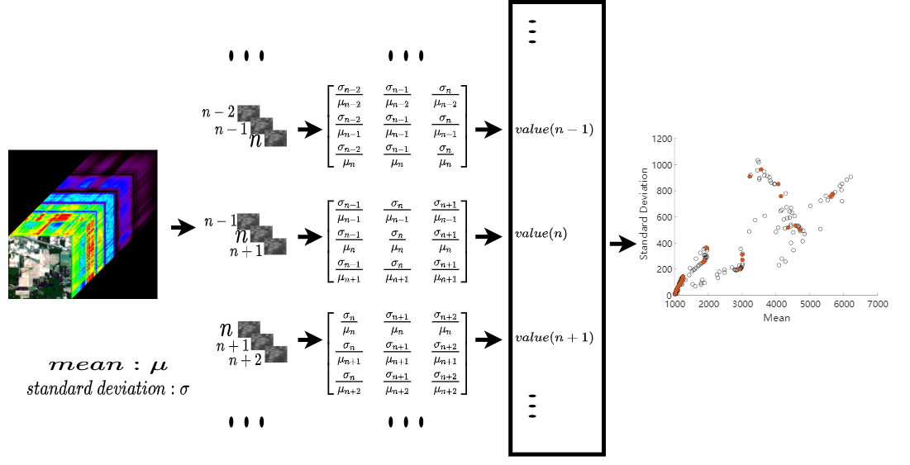

# Band Ranking via Extended Coefficient of Variation for Hyperspectral Band Selection

## Datasets

Please download the datasets from [this link](http://www.ehu.eus/ccwintco/index.php/Hyperspectral_Remote_Sensing_Scenes) and put them under the `datasets` folder. In our experiments, we use the
`corrected` scenes (w/o water absorption bands). Basically, the scene file, corrected scene file, and the ground truth file are required (in `.mat` format). Please modify the `read_images.m` under `utils`, if you only have the corrected scene data or the scene data.

## How to use

1. Please put your hyperspectral data sets under the `datasets` folder.
2. Change the variable `fn` in `demo.m`
3. Change the variable `num_select` in `demo.m` (for classification)
4. Change the variable `loop_times` in `demo.m` (for classification)
5. Run `demo.m`

## License

The code is released under [GPLv3 license](https://www.gnu.org/licenses/gpl-3.0.en.html).
